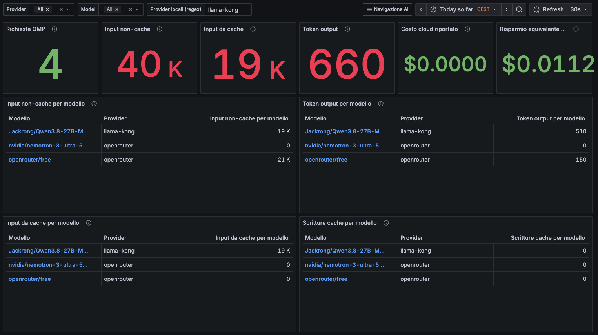
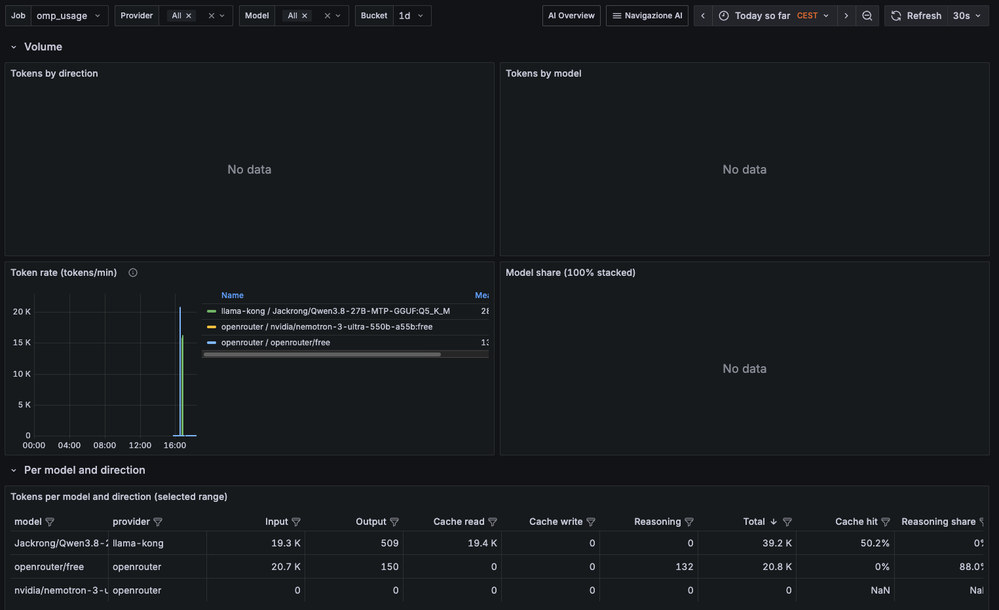
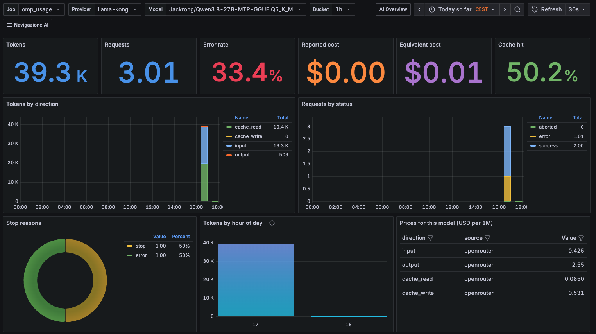

# Grafana dashboards v2

The `examples/grafana/dashboards-v2/` folder contains an advanced dashboard
set for usage, cache behavior and cost analysis.

## What is new in v2

- **AI navigation** flow between overview and drilldown dashboards.
- **Input split** between `input` and `cache_read`, visible in both counters and
  model tables.
- Better visibility of **reported cloud cost** versus **equivalent cost** and
  **savings** when usage runs locally.
- Expanded model dashboard with token composition, reliability signals and
  price table by direction.

This makes it easier to justify local inference adoption with measurable
token-level and cost-level evidence.

## Screenshots

### 1) AI overview (v2)

The overview surfaces requests, non-cache input, cache input, output tokens,
reported cloud cost, and equivalent savings in one row.



### 2) Tokens dashboard (v2)

The tokens view adds per-model directional details, including cache read/write
and reasoning share.



### 3) Model dashboard (v2)

The model drilldown combines token direction mix, request status, stop reasons,
hourly distribution and directional prices for that model.



## Provisioning

Use the same Grafana provider file documented in [Grafana](grafana.md), but
mount `examples/grafana/dashboards-v2/` into
`/var/lib/grafana/dashboards/omp-usage`.

```yaml
services:
  grafana:
    image: grafana/grafana:13.2.3
    volumes:
      - ./omp-usage/examples/grafana/dashboards-v2:/var/lib/grafana/dashboards/omp-usage:ro
      - ./omp-usage/examples/grafana/provisioning/dashboards/omp-usage.yml:/etc/grafana/provisioning/dashboards/omp-usage.yml:ro
```
